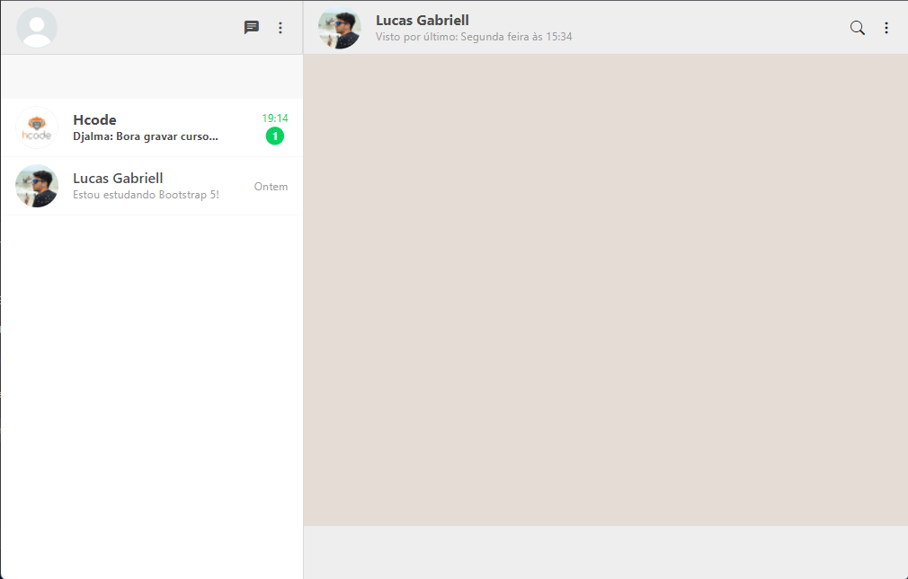

<h1 align="center">
  💻 WhatsApp Web
</h1>

  

<h4 align="center"><a href="https://whatsapp-web-mu.vercel.app/">Clique para visitar o projeto</a></h4>

## 📚 Sobre o projeto

Desafio proposto pelo curso de <strong>Bootstrap 4 da Hcode Treinamentos.</strong>  
Meu primeiro projeto feito usando Bootstrap, trata-se de um clone do WhatsApp Web.

💡 <b>Observação:</b> Nesse projeto fiz uso do Bootstrap 5!

## 💼 Tecnologias utilizadas

- HTML;
- CSS;
- Bootstrap;
